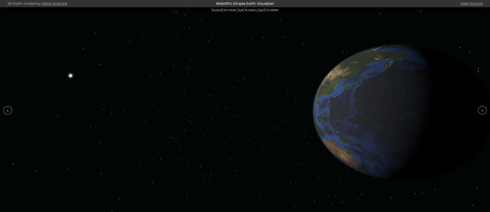

# WebGPU Simple Earth Visualizer



## Overview

This is a simple Earth visualizer using WebGPU written in Rust with `wgpu` and `wasm-bindgen`.

- `/graphics`: Graphics Backend in Rust
- `/view`: Web Frontend in TypeScript

## Deployment

https://webgpu-simple-earth.peruki.dev

## Build

```
$ cd graphics
$ make build
$ cd ../view
$ npm install
$ npm run build
```

## Credit

The 3D model of the Earth has been obtained from [NASA](https://www.nasa.gov/) under the terms of [NASA Images and Media Usage Guidelines](https://www.nasa.gov/nasa-brand-center/images-and-media).

https://science.nasa.gov/resource/earth-3d-model/

## License

MIT License

Copyright (c) 2024 [Teruki TADA](https://peruki.dev)